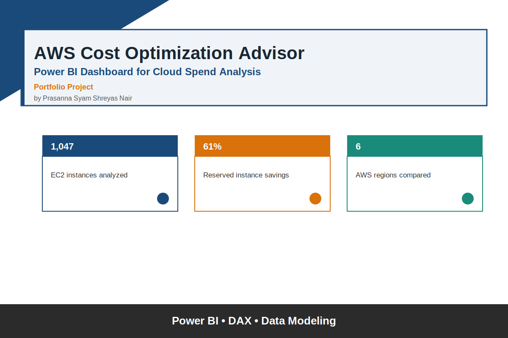
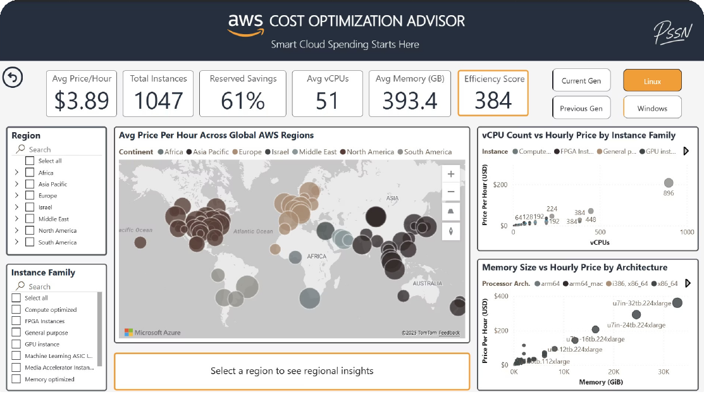
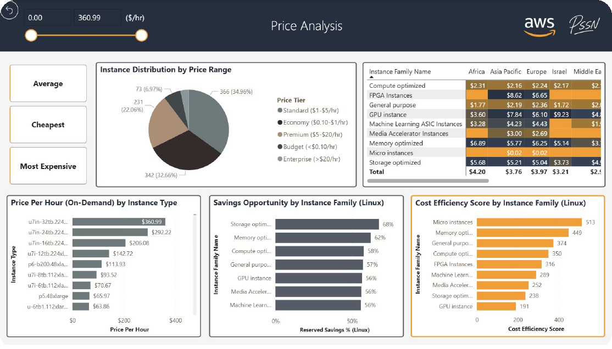

# AWS Cost Optimization Advisor — Power BI Dashboard

An interactive Power BI dashboard for cloud cost analysis, built around real AWS EC2 pricing data — designed for cloud architects, FinOps analysts, and decision-makers who need to compare pricing, spot anomalies, and find savings opportunities across regions and instance types.

## What it covers
- **Global EC2 pricing** — average price per hour across all AWS regions, plotted on a world map
- **Cost anomalies** — vCPU count vs. hourly price, memory size vs. hourly price, by instance family and processor architecture
- **Savings opportunities** — reserved savings %, rightsizing recommendations by instance family
- **Linux vs. Windows** pricing comparison, toggleable via report parameters
- **Instance pricing analysis** — price-tier distribution, per-region breakdowns, cost efficiency scoring

## How it's built
- Data sourced from official AWS pricing data, sampled and cleaned in Google Colab before loading into Power BI
- **Star schema** data model linking dimension and fact tables
- Calculated measures: cost efficiency score (composite), savings %, price difference vs. global average
- Field parameters for dynamic metric switching (e.g. toggling OS)

## Tech
Power BI (`.pbix`), DAX measures, Google Colab for data prep

---
*Note: opening the `.pbix` file requires Power BI Desktop (Windows). The screenshots above show the dashboard in action.*
